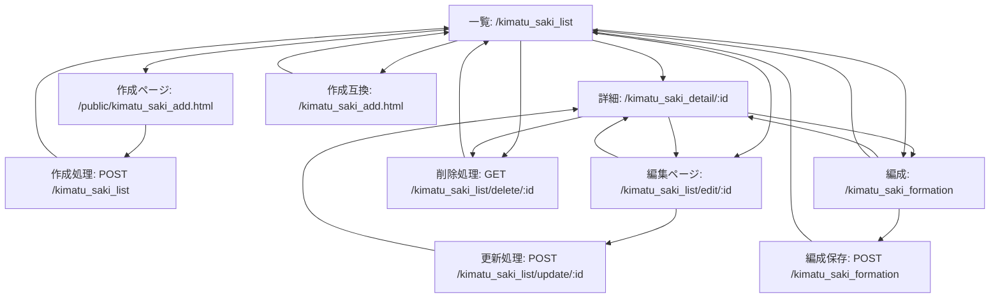

```mermaid
flowchart TD
  A[一覧: /kimatu_saki_list] --> B[作成ページ: /public/kimatu_saki_add.html]
  B --> C[作成処理: POST /kimatu_saki_list]
  C --> A

  A --> D[詳細: /kimatu_saki_detail/:id]
  A --> E[編集ページ: /kimatu_saki_list/edit/:id]
  E --> F[更新処理: POST /kimatu_saki_list/update/:id]
  F --> D


  A --> G[削除処理: GET /kimatu_saki_list/delete/:id]
  G --> A

  D --> I[編成: /kimatu_saki_formation]
  I --> D
  I --> A
  E --> D
  D --> G
  D --> E


  A --> H[作成互換: /kimatu_saki_add.html]
  H --> A

  A --> I[編成: /kimatu_saki_formation]
  I --> J[編成保存: POST /kimatu_saki_formation]
  J --> A
```