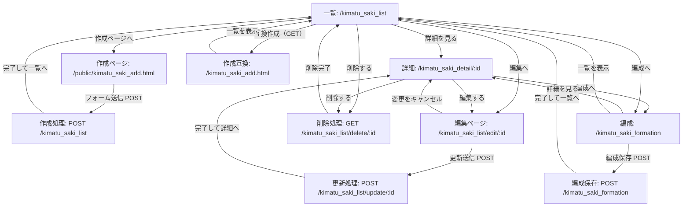

```mermaid
flowchart TD
  A[一覧: /kimatu_saki_list] -->|作成ページへ| B[作成ページ: /public/kimatu_saki_add.html]
  B -->|フォーム送信 POST| C[作成処理: POST /kimatu_saki_list]
  C -->|完了して一覧へ| A

  A -->|詳細を見る| D[詳細: /kimatu_saki_detail/:id]
  A -->|編集へ| E[編集ページ: /kimatu_saki_list/edit/:id]
  E -->|更新送信 POST| F[更新処理: POST /kimatu_saki_list/update/:id]
  F -->|完了して詳細へ| D


  A -->|削除する| G[削除処理: GET /kimatu_saki_list/delete/:id]
  G -->|削除完了| A

  D -->|編成へ| I
  I -->|詳細を見る| D
  I -->|一覧を表示| A
  E -->|変更をキャンセル| D
  D -->|削除する| G
  D -->|編集する| E


  A -->|互換作成（GET）| H[作成互換: /kimatu_saki_add.html]
  H -->|一覧を表示| A

  A -->|編成へ| I[編成: /kimatu_saki_formation]
  I -->|編成保存 POST| J[編成保存: POST /kimatu_saki_formation]
  J -->|完了して一覧へ| A
```