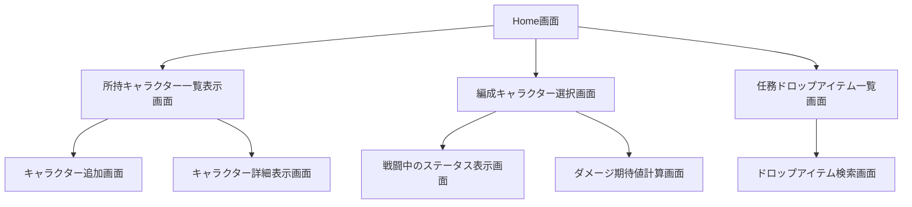

#　開発者用仕様書

## 基本概要

###　はじめに

本仕様書は，一覧表示をベースとしたWebアプリケーションを3つ開発することを目的としている．
統一した操作によるデータの一覧や詳細表示，追加，削除，変更を実装し，データは変数内に記録するものとする．
また，Reactは使用せず，純粋なHTML，CSS，JavaScriptで実装することでWebアプリケーションの開発の流れを理解することを主要目的とする．

### 使用技術

本アプリケーションは，以下の技術を使用して開発する．
名称　|　使用用途
----|----
HTML | Webページの構造を記述する
CSS | Webページの見た目を装飾する
JavaScript | Webページの動的な動作を実装する

## 開発システムの概要

### システム構成

本システムは，以下の3つのWebアプリケーションから構成される．
1. 所持キャラクターの一覧システム
1. 所持キャラクターからの編成システム
1. 所持キャラクターの詳細表示システム
1. 編成キャラクターのダメージの期待値計算システム
1. 任務(ストーリー)におけるドロップアイテム一覧・検索システム

### データ構造

本システムで使用するデータは，以下のような構造を持つ．
- 所持キャラクター
  - キャラクターID
  - キャラクター名
  - レアリティ
  - 属性
  - ステータス
    - HP
    - 攻撃力
    - 防御力
    - 治癒力
    - 会心値
    - 会心ダメージ率
    - 安定値
    - スキル
        - Exスキル
            - 効果
            - コスト
        - ノーマルスキル
            - 効果
            - 持続時間
            - クールタイム
            - 発動条件
        - パッシブスキル
            - 効果
        - サブスキル
            - 効果
            - 持続時間
            - クールタイム
    - WB
        - HP
        - 攻撃力
        - 治癒力
    - 装備
        - 装備1
            - 効果
        - 装備2
            - 効果
        - 装備3
            - 効果
    - 固有武器
        - HP
        - 攻撃力
        - 治癒力
        - 効果
- 編成キャラクター
  - キャラクターID
  - 編成スロット
- 任務ドロップアイテム
  - 任務ID
  - 任務名
  - ドロップアイテム一覧
    - アイテムID
    - アイテム名
    - レアリティ
    - ドロップ率

### 画面構成

各アプリケーションの画面構成は以下の通りである．

1. 所持キャラクターの一覧システム
    - キャラクター一覧表示画面
    - キャラクター追加画面
1. 所持キャラクターからの編成システム
    - 編成キャラクター選択画面
    - 戦闘中のステータス表示画面
1. 所持キャラクターの詳細表示システム
    - キャラクター詳細表示画面
1. 編成キャラクターのダメージの期待値計算システム
    - ダメージ期待値計算画面
1. 任務(ストーリー)におけるドロップアイテム一覧・検索システム
    - 任務ドロップアイテム一覧画面
    - ドロップアイテム検索画面

### ページ遷移図

以下に各アプリケーションのページ遷移図を示す．

この遷移図は，各アプリケーション間の主要なページ遷移を示している．ユーザーはHome画面から各アプリケーションの主要画面にアクセスでき，さらに各画面から関連する詳細画面へと遷移できる．
